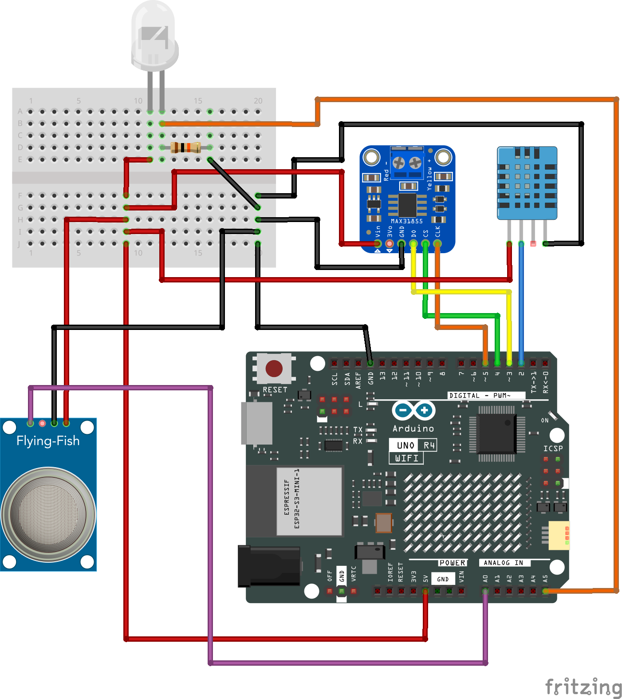

# Lowtech-guide

Marche à suivre pour installer et récupérer les données de température, d'humidité et de gaz carbonique dans le cadre du suivi thermique d'un habitat peu énergivore.


## Matériel nécessaire
* arduino R4 Wifi + cable usb-c
* raspberry pi
* MAX31855 : capteur temperature avec câble
* Dht11 : capteur humidité-température
* MQ135 : capteur CO2
* breadboard
* led qui capte la lumière
* 10Kohm re`ésitance


## Installation

télécharger le logiciel arduino et installer dans le library manager : 
- DHT11 by Dhruba Saha
- Adafruit_Max31855
- MQ135-XCR by X-croot

Brancher les capteurs selon ce schéma



Uploader le fichier arduinoToPi.ino dans l'arduino
Vérifier par Serial que les 5 données s'affichent. Fermer le programme.

Ouvrir un terminal : Ctrl-T

Aller dans le dossier et tester le script Python :
```bash
cd /home/myself/Lowtech-guide
python serialArduino.py
```
Vérifier dans /assets/data1.csv que les données ont été enregistrer

### Lancement toutes les 15 minutes

- lancer cron avec nano
```bash
crontab -e
```
- ajouter la ligne suivante à la fin du fichier
```bash
*15 * * * * python /home/myself/Lowtech-guide/serialArduino.py
```
- Sauver : Ctrl-O 
- Quitter Ctrl-X

Si tout va bien tous les 15 minutes une ligne est ajoutée au fichier data1.csv


## Errors

#### Erreur dans le terminal

Remplacer 'myself' par le nom du raspberry. Vérifier les chemins. 

#### PPM indique 0

Le capteur de CO2 n'est pas opérationnel. Problème au-delà de ma compétence.

